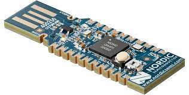
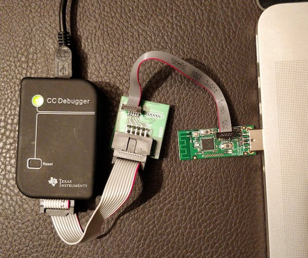
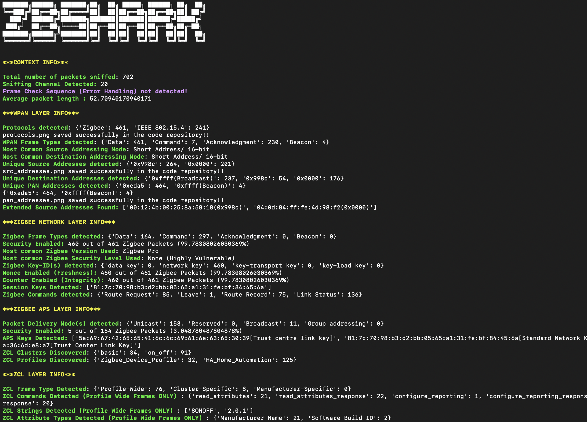

# 3rd Year Individual Project

## Introduction

1. The project aims to find a solution for being able to identify wireless security devices (ZigBee) responsible for monitoring intruders.
2. Hence, the project is more research-oriented dealing with various hardware devices and pre-existing applications like Wireshark to create a suitable environment, generate Zigbee traffic, and sniff it using certain hardware and firmware (All details given below to create the suitable environment).
3. Additionally, I have developed a Python script to automate some of the processes and make it more friendly to someone not familiar with ZigBee and packet capturing to be able to make sense of the data coming through (Provided in the repository along with screenshots).

## Getting Started

1. The environment required to generate the data is complex and requires external hardware.
2. ZBShark can be easily used as an interactive shell to interact with the hardware interface as well as the saved capture files.

## Resources

- Zigbee Devices
  - [ZB Bridge](https://sonoff.tech/product/gateway-and-sensors/zbbridge/)
  - [Zigbee Smart Plug](https://sonoff.tech/product/s26r2zb/)
  - [Zigbee Door/Window Sensor](https://sonoff.tech/product/gateway-and-sensors/snzb-04/)
  - [Innr Bridge](https://www.innr.com/en/product/innr-bridge-uk-version/)
  - [Innr Smart Button](https://www.innr.com/en/product/smart-button/)
- Sniffing Zigbee Traffic (Hardware)
  - **[nRF52840 Dongle](https://www.nordicsemi.com/Products/Development-hardware/nRF52840-Dongle)**
  - [CC2531EMK](https://www.ti.com/tool/CC2531EMK#description)
  - **[CC-DEBUGGER](https://www.ti.com/tool/CC-DEBUGGER)**
  - [Zig-ah-Zig-ah](https://zigbee.blakadder.com/Electrolama_zzh.html)
- Sniffing Zigbee Traffic (Software)
  - Kismet
  - WireShark
  - Putty
  - [nRF Connect For Desktop](https://www.nordicsemi.com/Software-and-Tools/Development-Tools/nRF-Connect-for-desktop)
  - [Packet-Sniffer](https://www.ti.com/tool/PACKET-SNIFFER)
  - [ZBoss](https://dsr-iot.com/downloads/)
  - [SmartRF Packet Sniffer](https://dev.ti.com/tirex/explore/node?node=A__ACoQVjnKSte6jQvdYpYO9g__simplelink-devtools__FUz-xrs__LATEST)
  - SmartRF Flash Programmer
  - SmartRF Studio 7
- ZBShark (Python Script)
  - Python3 (Tested on Python3.11)
  - Wireshark/Tshark
  - PyShark
  - Matplotlib

## Setting Up the Environment

### Setting up the Zigbee Environment

1. **Sonoff Zigbee Environment**
   1. Devices
      1. [ZB Bridge](https://sonoff.tech/product/gateway-and-sensors/zbbridge/)
      2. [Zigbee Smart Plug](https://sonoff.tech/product/s26r2zb/)
      3. [Zigbee Door/Window Sensor](https://sonoff.tech/product/gateway-and-sensors/snzb-04/)
   2. The devices come alongside a [manual](https://sonoff.tech/usermanuals/) to help set them up with [eWeLink](https://sonoff.tech/ewelink/)
2. **Innr Zigbee Environment**
   1. Devices
      1. [Innr Bridge](https://www.innr.com/en/product/innr-bridge-uk-version/)
      2. [Innr Smart Button](https://www.innr.com/en/product/smart-button/)
   2. The devices come alongside a [manual](https://www.innr.com/en/support/setting-up-your-smart-innr-zigbee-system/) to help set them up with the Innr App

Take some time off to understand the functioning of each component within the two networks before continuing with the sniffing.

### Setting up nRF52840 and its Sniffing Environments

- Get Nordic’s [nRF52840 dongle](https://www.nordicsemi.com/Products/Development-hardware/nRF52840-Dongle) to provide the interface for sniffing Zigbee traffic.
- Install Python3.7 or further
- Clone the [nRF Sniffer for 802.15.4](https://github.com/NordicSemiconductor/nRF-Sniffer-for-802.15.4) GitHub respository
- Install [nRF Connect For Desktop](https://www.nordicsemi.com/Software-and-Tools/Development-Tools/nRF-Connect-for-desktop)
- [Program the firmware](https://infocenter.nordicsemi.com/topic/ug_sniffer_802154/UG/sniffer_802154/programming_firmware_802154.html) to the development kit
- **Capturing traffic using Zigbee CLI**
  - nRF Connect app comes with Zigbee Command Line Interface (CLI) where commands can be issued by **_using_** a serial line connection **_with_** a terminal application like **_PuTTy_**
  - Kindly follow [these](https://infocenter.nordicsemi.com/index.jsp?topic=%2Fsdk_tz_v3.1.0%2Fzigbee_example_cli_agent.html) steps to successfully read serial Zigbee traffic (Raw Dump).
- **Capturing traffic using Kismet**
  - Follow the steps [here](https://www.kismetwireless.net/docs/readme/installing/intro_compiling/) to install Kismet.
  - Follow the steps [here](https://www.kismetwireless.net/docs/readme/datasources/zigbee-nrf52840/) to set up Kismet for nRF52840 Zigbee sniffing.
  - It can be run through the terminal:
    `kismet -c 'nrf528400:device=/dev/ttyUSB0,name=Foo,channels="12,13,14,15"’`
    - Ensure that the device location is set correctly (can be discovered through nRF Connect)
    - Ensure that you are sniffing on the right channel for your ZigBee devices.
- **Capturing traffic using Wireshark**
  - Install [Wireshark](https://www.wireshark.org/)
  - Install the [nRF Sniffer Capture Plugin for Wireshark](https://infocenter.nordicsemi.com/index.jsp?topic=%2Fug_sniffer_802154%2FUG%2Fsniffer_802154%2Fintro_802154.html).
  - Now, when you load up Wireshark, it displays the Wireshark hardware interfaces connected to the nRF Sniffer (default channel set to 11).
  - Configure Wireshark for Zigbee sniffing as stated [here](https://infocenter.nordicsemi.com/index.jsp?topic=%2Fug_sniffer_802154%2FUG%2Fsniffer_802154%2Finstalling_sniffer_802154.html)
  - You are now ready to start sniffing provided the right Zigbee and dongle setup.

### Setting up CC2531 and its Sniffing Environments

- Get [Texas Instrument’s CC2531 USB Dongle](https://www.ti.com/tool/CC2531EMK) to provide the interface for sniffing Zigbee traffic.
- Download the Zboss Sniffer firmware hex for the CC2531 USB dongle [here](https://zboss.dsr-wireless.com/attachments/download/72/zboss_sniffer.hex?back_url=http%3A%2F%2Fzboss.dsr-wireless.com%2Fdownloads%2Findex%2Fzboss)
- Get the [CC-Debugger](https://www.ti.com/tool/CC-DEBUGGER) hardware and install the **[SmartRF Flash programmer](http://www.ti.com/tool/flash-programmer)** as well as the **[CC debugger driver](https://www.ti.com/tool/CC-DEBUGGER).**
- Follow the steps mentioned [here](https://www.zigbee2mqtt.io/guide/adapters/flashing/flashing_the_cc2531.html) to flash the CC2531 dongle with the help of CC Debugger.
- **Capturing traffic using TI’s SmartRF Packet Sniffer**
  - Download TI’s SmartRF Packet Sniffer [here](https://www.ti.com/tool/PACKET-SNIFFER).
  - Follow the steps mentioned [here](https://www.waveshare.com/w/upload/7/79/Swru187f.pdf) to set up the software and sniff Zigbee Traffic (Mentioned in more depth in report)
- Capturing traffic using Wireshark
  - Download and Install [Wireshark](https://www.wireshark.org/)
  - Now plug in your CC2531 stick into your PC’s USB port.
  - Click on start in the Zboss sniffer GUI it will auto open Wireshark.
  - Configure Wireshark for Zigbee sniffing as stated [here](https://infocenter.nordicsemi.com/index.jsp?topic=%2Fug_sniffer_802154%2FUG%2Fsniffer_802154%2Finstalling_sniffer_802154.html).
  - Refer [here](https://community.oh-lalabs.com/t/guide-build-a-zigbee-cc2531-sniffer-how-to-use-it/469) for more guidance.

### Setting up ZBShark

- A Python script developed on top of Pyshark for Zigbee application
- Requirements
  - Python3.7+ (Tested on Python3.11)
  - Modern versions of tshark / wireshark
  - [Pyshark](https://github.com/KimiNewt/pyshark)
  - Matplotlib
- Features
  - Zigbee Traffic Capture
    - `python3 zbshark.py live_capture <interface> <output_file> <packet_number>`
  - Filtering the capture file (.pcap/.pcapng)
    - `python3 zbshark.py sniff_with_filter <file_path> <filter_name>`
  - Summarise a capture file (Main Feature)
    - `python3 zbshark.py sniff_summary <file_path>`
    - Also generates visual graphs (Histograms) to display some statistics eg: different protocols used. Samples present in the ZBShark folder.

### Additional Resources

- [KillerBee](https://github.com/riverloopsec/killerbee)
- [Zigbee Profile For Wireshark](https://github.com/akestoridis/wireshark-zigbee-profile)
- [Scapy](https://github.com/secdev/scapy/blob/master/scapy/layers/zigbee.py)
- [Zigbee Alliance Documentation](https://zigbeealliance.org/wp-content/uploads/2019/11/docs-05-3474-21-0csg-zigbee-specification.pdf)
